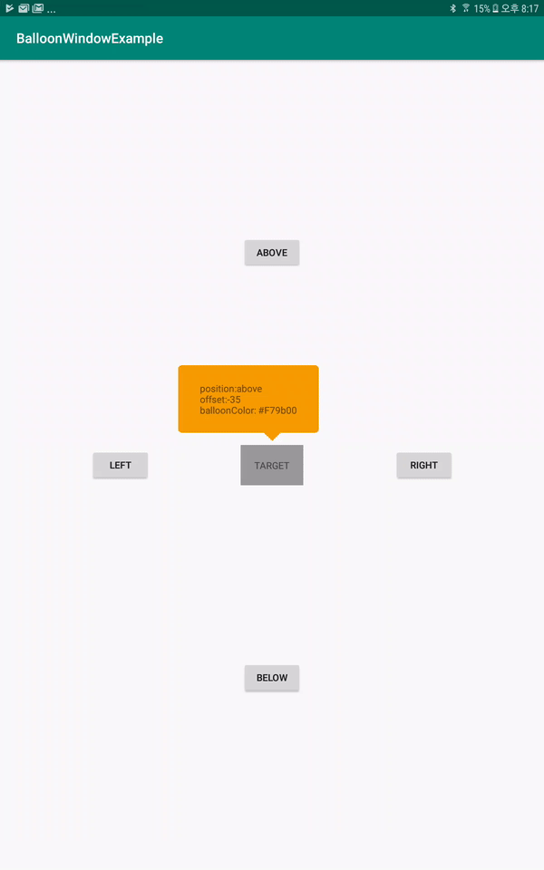

# android-BalloonWindow

[](https://jitpack.io/#hyuntae0117/android-BalloonWindow)



## Download

```gradle
allprojects {
    repositories {
        ...
        maven { url 'https://jitpack.io' }
    }
}

dependencies {
    implementation 'com.github.hyuntae0117:android-BalloonWindow:0.1.2'
}
```

## Usage

### basic usage
```kotlin
val view = TextView(this)
view.text = "position:below"

val window = BalloonWindow(this, targetView, BalloonWindow.Position.below)
window.offset = 48
window.paddingTop = 40
window.margin = 10
window.show(view)
```

### position
There are four types of positions
```kotlin
val window = BalloonWindow(.., .., position: Position)
```

- **Position.above**: will appear above the target

- **Position.below**: will appear below the target

- **position.right**: will apper right hand side of the target

- **position.left**: will appear left hand side of the target

### offset

### padding

### 
